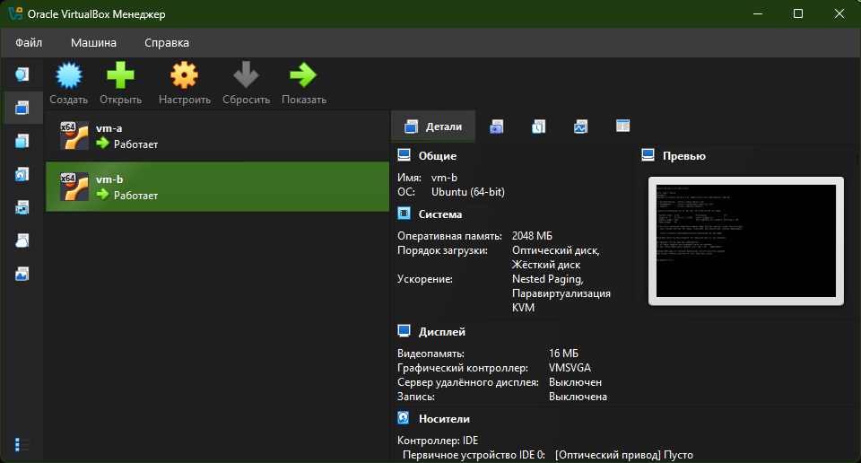
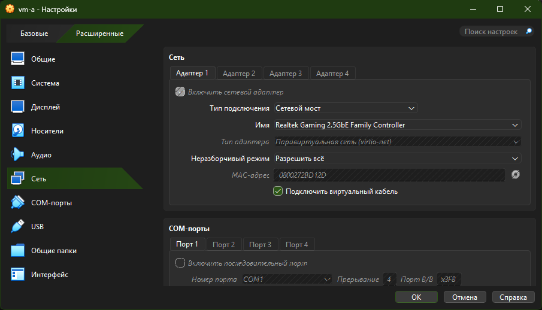
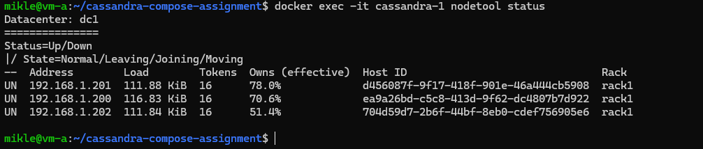
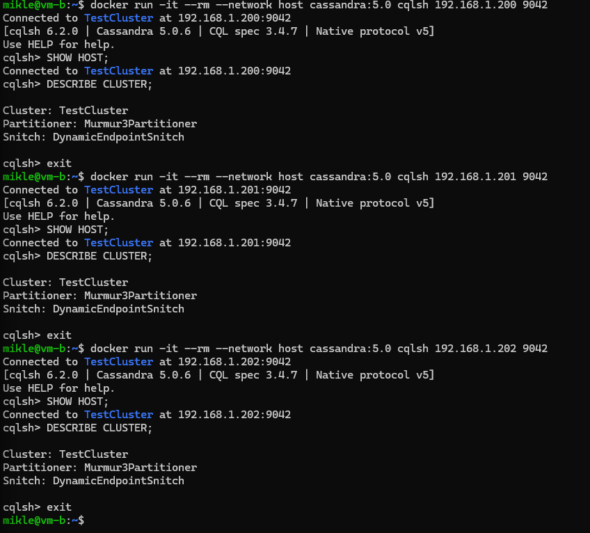
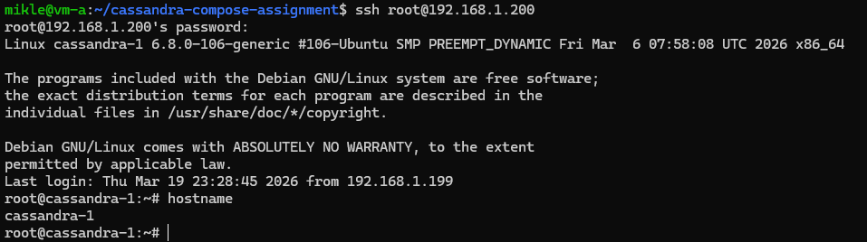

# Тестовое задание: развертывание кластера Cassandra в Docker Compose
## Задание

 1. На машине А (ubuntu 24.04 lts) в локальной сети с ip 192.168.1.197 запускается скрипт docker-compose для поднятия 3 образов с ip адресами 192.168.1.200-202.
 2. Затем с машины Б (ubuntu 24.04 lts) из той же локальной сети с ip 192.168.1.198 необходимо подключиться через cqlsh к каждой из машин-образов.
 3. Настроить ssh для возможности подключения к 1.200 с 1.197
 4. Все приведённые операции необходимо задокументировать и описать инструкцией с командами и объяснениями в Readme
 5. Добавить скриншот результата в Readme.

## Стенд

В ходе решения задачи, на локальном ПК, были развернуты две виртуальные машины, с использованием VirtualBox:

  - **vm-a** - Ubuntu 24.04 LTS, IP `192.168.1.197`
  - используется как Docker-host
  - на ней через Docker Compose поднят кластер Cassandra

  - **vm-b** - Ubuntu 24.04 LTS, IP `192.168.1.198`
  - используется как клиентская машина
  - с неё выполняется подключение к узлам Cassandra через cqlsh

  Контейнеры Cassandra на `vm-a` функционируют в своей, отдельной Docker-сети и имеют следующие IP адреса:
  
  - `cassandra-1` - `192.168.1.200`
  - `cassandra-2` - `192.168.1.201`
  - `cassandra-3` - `192.168.1.202`

## Используемая архитектура

Для выполнения задания использована сеть Docker типа **macvlan**.

Это было необходимо, потому что обычная bridge сеть Docker не позволяет выдать контейнерам отдельные IP-адреса в основной локальной сети.  
`macvlan` позволяет контейнерам выглядеть как отдельные устройства в LAN, поэтому каждый узел Cassandra получает собственный IP-адрес:

- `192.168.1.200`
- `192.168.1.201`
- `192.168.1.202`

Особенность `macvlan` состоит в том, что Docker-host по умолчанию не может напрямую обращаться к своим `macvlan` - контейнерам.  
Поэтому для доступа с `vm-a` к `192.168.1.200` был дополнительно использован host-side интерфейс через скрипт `host-macvlan.sh`.

## Подготовка к работе

Для выполнения задания были созданыдве виртуальные машины:

### vm-a
- Ubuntu 24.04 LTS
- IP: `192.168.1.197`
- роль: Docker host

### vm-b
- Ubuntu 24.04 LTS
- IP: `192.168.1.198`
- роль: клиентская машина для проверки подключения через cqlsh

Для обеих виртуальных машин использовалась настройка сети:

- `Сетевой мост`
- Привязка к физическому Ethernet-адаптеру
- `Неразборчивый режим = Разрешить всё`

Это было необходимо для корректной работы macvlan.





## Развертывание кластера Cassandra

На vm-a был подготовлен проект со следующей структурой:

```cassandra-compose-assignment/
├── .env.example
├── README.md
├── Dockerfile
├── docker-compose.yml
├── docker/
│   └── entrypoint-with-ssh.sh
├── scripts/
│   ├── up.sh
│   ├── down.sh
│   └── host-macvlan.sh
└── assets/
```

## Проверка результата

После запуска, на vm-a вывел статус кластера:



Все узлы в состоянии UN.

С vm-b проверил подключение к каждому узлу:



Внутри sqlsh выполнялись команды:
`SHOW HOST;`
`DESCRIBE CLUSTER;`

Таким образом, с vm-b выполняется подключение к каждому из трех узлов Cassandra по отдельному IP адресу.

Для доступа с vm-a к macvlan контейнеру был поднят host-side интерфейс, после чего можно было подключится по SSH:



SSH подключение выполнено успешно.

## Файлы проекта

- `docker-compose.yml` - описание сервисов Cassandra и `сети macvlan`
- `Dockerfile` - кастомный образ Cassandra с установленным SSH сервером
- `docker/entrypoint-with-ssh.sh` - скрипт запуска sshd и Cassandra
- `scripts/up.sh` - сборка и запуск кластера
- `scripts/down.sh` - остановка кластера
- `scripts/host-macvlan.sh` - создание host-side `macvlan` интерфейса на `vm-a`
- `.env.example` - шаблон конфигурации сети и IP адресов

`.env.example:`
```
# Имя физического интерфейса на VM A, который смотрит в локальную сеть
PARENT_IFACE=enp0s3

# Сеть локальной сети
SUBNET=192.168.1.0/24
GATEWAY=192.168.1.1

# IP-адреса контейнеров Cassandra
CASSANDRA_1_IP=192.168.1.200
CASSANDRA_2_IP=192.168.1.201
CASSANDRA_3_IP=192.168.1.202

# IP для host-side macvlan интерфейса на VM A
HOST_MACVLAN_IP=192.168.1.199

# Имя кластера Cassandra
CASSANDRA_CLUSTER_NAME=TestCluster
```

`Dockerfile:`
```
FROM cassandra:5.0

USER root

RUN apt-get update && \
    apt-get install -y --no-install-recommends \
        openssh-server \
        procps \
        iproute2 \
        iputils-ping \
        net-tools \
        nano && \
    mkdir -p /run/sshd && \
    echo 'root:rootpass' | chpasswd && \
    sed -ri 's/^#?PermitRootLogin\s+.*/PermitRootLogin yes/' /etc/ssh/sshd_config && \
    sed -ri 's/^#?PasswordAuthentication\s+.*/PasswordAuthentication yes/' /etc/ssh/sshd_config && \
    sed -ri 's/^#?UsePAM\s+.*/UsePAM yes/' /etc/ssh/sshd_config && \
    ssh-keygen -A && \
    apt-get clean && \
    rm -rf /var/lib/apt/lists/*

COPY docker/entrypoint-with-ssh.sh /usr/local/bin/entrypoint-with-ssh.sh
RUN chmod +x /usr/local/bin/entrypoint-with-ssh.sh

ENTRYPOINT ["/usr/local/bin/entrypoint-with-ssh.sh"]
CMD ["cassandra", "-f"]
```

`entrypoint-with-ssh.sh:`
```
#!/usr/bin/env bash
set -e

service ssh start

exec /usr/local/bin/docker-entrypoint.sh "$@"
```

`docker-compose.yml:`
```
services:
  cassandra-1:
    build: .
    image: local/cassandra-ssh:5.0
    container_name: cassandra-1
    hostname: cassandra-1
    environment:
      CASSANDRA_CLUSTER_NAME: "${CASSANDRA_CLUSTER_NAME:-TestCluster}"
      CASSANDRA_LISTEN_ADDRESS: "${CASSANDRA_1_IP:-192.168.1.200}"
      CASSANDRA_BROADCAST_ADDRESS: "${CASSANDRA_1_IP:-192.168.1.200}"
      CASSANDRA_SEEDS: "${CASSANDRA_1_IP:-192.168.1.200},${CASSANDRA_2_IP:-192.168.1.201},${CASSANDRA_3_IP:-192.168.1.202}"
      CASSANDRA_ENDPOINT_SNITCH: "GossipingPropertyFileSnitch"
      MAX_HEAP_SIZE: "512M"
      HEAP_NEWSIZE: "100M"
    networks:
      cassandra_lan:
        ipv4_address: "${CASSANDRA_1_IP:-192.168.1.200}"
    volumes:
      - cassandra1-data:/var/lib/cassandra
    restart: unless-stopped

  cassandra-2:
    build: .
    image: local/cassandra-ssh:5.0
    container_name: cassandra-2
    hostname: cassandra-2
    environment:
      CASSANDRA_CLUSTER_NAME: "${CASSANDRA_CLUSTER_NAME:-TestCluster}"
      CASSANDRA_LISTEN_ADDRESS: "${CASSANDRA_2_IP:-192.168.1.201}"
      CASSANDRA_BROADCAST_ADDRESS: "${CASSANDRA_2_IP:-192.168.1.201}"
      CASSANDRA_SEEDS: "${CASSANDRA_1_IP:-192.168.1.200},${CASSANDRA_2_IP:-192.168.1.201},${CASSANDRA_3_IP:-192.168.1.202}"
      CASSANDRA_ENDPOINT_SNITCH: "GossipingPropertyFileSnitch"
      MAX_HEAP_SIZE: "512M"
      HEAP_NEWSIZE: "100M"
    networks:
      cassandra_lan:
        ipv4_address: "${CASSANDRA_2_IP:-192.168.1.201}"
    volumes:
      - cassandra2-data:/var/lib/cassandra
    depends_on:
      - cassandra-1
    restart: unless-stopped

  cassandra-3:
    build: .
    image: local/cassandra-ssh:5.0
    container_name: cassandra-3
    hostname: cassandra-3
    environment:
      CASSANDRA_CLUSTER_NAME: "${CASSANDRA_CLUSTER_NAME:-TestCluster}"
      CASSANDRA_LISTEN_ADDRESS: "${CASSANDRA_3_IP:-192.168.1.202}"
      CASSANDRA_BROADCAST_ADDRESS: "${CASSANDRA_3_IP:-192.168.1.202}"
      CASSANDRA_SEEDS: "${CASSANDRA_1_IP:-192.168.1.200},${CASSANDRA_2_IP:-192.168.1.201},${CASSANDRA_3_IP:-192.168.1.202}"
      CASSANDRA_ENDPOINT_SNITCH: "GossipingPropertyFileSnitch"
      MAX_HEAP_SIZE: "512M"
      HEAP_NEWSIZE: "100M"
    networks:
      cassandra_lan:
        ipv4_address: "${CASSANDRA_3_IP:-192.168.1.202}"
    volumes:
      - cassandra3-data:/var/lib/cassandra
    depends_on:
      - cassandra-1
    restart: unless-stopped

networks:
  cassandra_lan:
    driver: macvlan
    driver_opts:
      parent: "${PARENT_IFACE:-enp0s3}"
    ipam:
      config:
        - subnet: "${SUBNET:-192.168.1.0/24}"
          gateway: "${GATEWAY:-192.168.1.1}"
          ip_range: "192.168.1.200/29"

volumes:
  cassandra1-data:
  cassandra2-data:
  cassandra3-data:
```

`up.sh:`
```
#!/usr/bin/env bash
set -euo pipefail

PROJECT_DIR="$(cd "$(dirname "${BASH_SOURCE[0]}")/.." && pwd)"
cd "$PROJECT_DIR"

if [[ ! -f .env ]]; then
  echo "Файл .env не найден."
  echo "Скопируйте .env.example в .env и при необходимости поправьте значения:"
  echo "  cp .env.example .env"
  exit 1
fi

echo "[1/4] Проверка Docker..."
docker version >/dev/null
docker compose version >/dev/null

echo "[2/4] Сборка образа..."
docker compose build --pull

echo "[3/4] Запуск кластера..."
docker compose up -d

echo "[4/4] Состояние контейнеров:"
docker compose ps

echo
echo "Кластер запущен."
echo "Проверка логов:"
echo "  docker logs -f cassandra-1"
echo
echo "Проверка статуса кластера:"
echo "  docker exec -it cassandra-1 nodetool status"
```

`down.sh:`
```
#!/usr/bin/env bash
set -euo pipefail

PROJECT_DIR="$(cd "$(dirname "${BASH_SOURCE[0]}")/.." && pwd)"
cd "$PROJECT_DIR"

echo "Останавливаю и удаляю контейнеры..."
docker compose down

echo "Готово."
echo "Если нужно также удалить volumes:"
echo "  docker compose down -v"
```

`host-macvlan.sh:`
```
#!/usr/bin/env bash
set -euo pipefail

PROJECT_DIR="$(cd "$(dirname "${BASH_SOURCE[0]}")/.." && pwd)"
cd "$PROJECT_DIR"

if [[ ! -f .env ]]; then
  echo "Файл .env не найден."
  echo "Скопируйте .env.example в .env:"
  echo "  cp .env.example .env"
  exit 1
fi

set -a
source .env
set +a

PARENT_IFACE="${PARENT_IFACE:-enp0s3}"
HOST_MACVLAN_IP="${HOST_MACVLAN_IP:-192.168.1.199}"
ROUTE_CIDR="192.168.1.200/29"
SHIM_NAME="macvlan-shim"

usage() {
  echo "Использование:"
  echo "  $0 up     - создать host-side macvlan интерфейс"
  echo "  $0 down   - удалить host-side macvlan интерфейс"
  echo "  $0 status - показать состояние"
}

cmd_up() {
  if ip link show "$SHIM_NAME" >/dev/null 2>&1; then
    echo "Интерфейс $SHIM_NAME уже существует."
  else
    sudo ip link add "$SHIM_NAME" link "$PARENT_IFACE" type macvlan mode bridge
    sudo ip addr add "${HOST_MACVLAN_IP}/32" dev "$SHIM_NAME"
    sudo ip link set "$SHIM_NAME" up
    sudo ip route add "$ROUTE_CIDR" dev "$SHIM_NAME"
    echo "Интерфейс $SHIM_NAME создан."
  fi

  echo
  ip addr show "$SHIM_NAME"
  echo
  ip route | grep "$ROUTE_CIDR" || true
  echo
  echo "Проверка связи:"
  ping -c 2 192.168.1.200 || true
}

cmd_down() {
  if ip route | grep -q "$ROUTE_CIDR"; then
    sudo ip route del "$ROUTE_CIDR" dev "$SHIM_NAME" || true
  fi

  if ip link show "$SHIM_NAME" >/dev/null 2>&1; then
    sudo ip link delete "$SHIM_NAME"
    echo "Интерфейс $SHIM_NAME удален."
  else
    echo "Интерфейс $SHIM_NAME не существует."
  fi
}

cmd_status() {
  ip link show "$SHIM_NAME" || true
  echo
  ip addr show "$SHIM_NAME" || true
  echo
  ip route | grep "$ROUTE_CIDR" || true
}

case "${1:-}" in
  up) cmd_up ;;
  down) cmd_down ;;
  status) cmd_status ;;
  *) usage; exit 1 ;;
esac
```